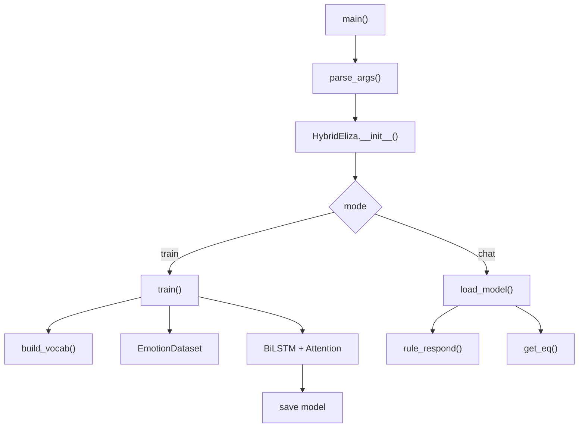

# Hybrid-ELIZA Multi (EN + Myanmar) Explanation

This document explains `slide-code/class-01/assignment-1/hybrid-eliza-multi.py`, the tokenizer options, and how to run it.

## What This File Does
- Supports **English** and **Myanmar** training/chat via `--lang`.
- Supports **multiple Myanmar tokenizers** via `--tokenizer`.
- Uses a BiLSTM + Attention classifier for emotions.
- Uses rule-based ELIZA responses for chat.

## Tokenizers Supported
- `mmdt` → `mmdt-tokenizer` (oppaWord-inspired)
- `myword` → `myWord` repo (Ye Kyaw Thu)
- `oppaword` → `oppaWord` repo (Ye Kyaw Thu)

If your oppaWord/myWord scripts output tokens to files, you can integrate them by preprocessing your dataset first.

## Install & Run

### Install Tokenizers (Git Clone)
```bash
git clone git@github.com:ye-kyaw-thu/oppaWord.git
git clone git@github.com:ye-kyaw-thu/myWord.git
```

### oppaWord CLI (example)
```bash
python3 oppa_word.py \
  --input text.txt \
  --dict data/myg2p_mypos.dict \
  --arpa data/myMono_clean_syl.trie.bin \
  --use-bimm-fallback \
  --bimm-boost 150 \
  --space-remove-mode "my_not_num"
```

### myWord CLI (example)
```bash
python3 myword.py build_dict dataset.csv

python3 ./myword.py word ./test.txt ./test.word
```

### Train with hybrid-eliza-multi.py

### Short oppaWord Command

Train Myanmar with mmdt:
```bash
python3 slide-code/class-01/assignment-1/hybrid-eliza-multi.py --mode train --lang mya --data slide-code/class-01/assignment-1/final.csv --tokenizer mmdt
```

Train Myanmar with oppaWord:
```bash
python3 slide-code/class-01/assignment-1/hybrid-eliza-multi.py --mode train --lang mya --data slide-code/class-01/assignment-1/final.csv --tokenizer oppaword
```

Train Myanmar with myword:
```bash
python3 slide-code/class-01/assignment-1/hybrid-eliza-multi.py --mode train --lang mya --data slide-code/class-01/assignment-1/final.csv --tokenizer myword --myword-dict /home/phantom/Desktop/Git/myWord/dict_ver1
```

Train English:
```bash
python slide-code/class-01/assignment-1/hybrid-eliza-multi.py --mode train --lang en --data slide-code/class-01/assignment-1/emotions.csv
```

Chat:
```bash
python slide-code/class-01/assignment-1/hybrid-eliza-multi.py --mode chat --lang mya --tokenizer mmdt
```

## Function Flow (High Level)

